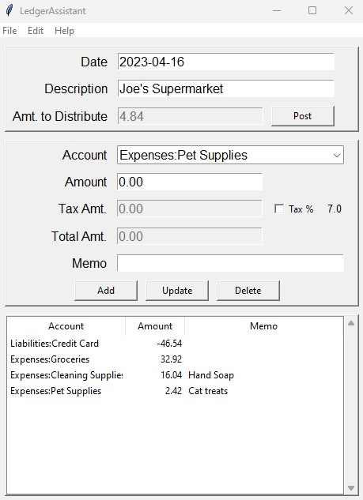

# Ledger Assistant
*v0.2.0*

Updated: 2023-04-16

## Introduction

**Ledger Assistant** is a GUI for entering multi-split transactions into an [hledger-style](https://hledger.org) plain text accounting journal.

If you are not familiar with the concept of *plain text accounting*, please check out the [hledger](https://hledger.org/) website. **hledger** is one of many plain text accounting applications available. **Ledger Assistant** was specifically designed to work alongside **hledger**, NOT as a replacement for it. **Ledger Assistant** is simply a convenient tool for entering transactions.  Use **hledger** or a similar app for tasks such as transaction journals, financial reporting, etc.

## Features
- Easily enter complex transactions into a plain text accounting journal.
- Uses the accounts listed at the beginning of the journal file.
- Automatically calculates of sales tax. Handles both taxable and non-taxable
  items in the same transaction
- Inserts transactions into the journal in correct sequence by date.

## License
 GNU General Public License 3. See the LICENSE file for details.
 
## Confguration
- See the file `config.ini`.

## Installation
- Written in Python 3.11.3. Not tested on earlier versions. 
- Download as a *.zip file and extract.
- Install the requirements (``requirements.txt``)
- run ``LedgerAssistant.py`` to launch.
 
## Screenshot

## Documentation
- Select a journal file by clicking **File** --> **Select Journal**. 
  A sample journal file, including accounts, is provided. File: ``sample.journal.``
- Enter date, transaction description and amount at top. The date will 
  be automatically formatted YYYY-MM-DD.
- Enter transaction splits in the **Enter Splits** section
- For each account split:
    - Select an account from the combo box.
    - Enter the amount to distribute.
    - Click the **Tax** checkbox if the amount is to have sales tax added.
      Enter the tax percent manually in the ``config.ini`` file if needed.
    - Enter a memo, such as a description of items purchased. (optional)
    - Click the **Add** button
    - The line amount is subtracted from the distribution amount, and the     
      remaining amount to distribute will display at the top.
- When finished, **Amount to Distribute** should be zero. 
- Click the **Post** button to add the transaction to the journal file.

## Credit
Big shout out to https://tkinter.com/ and [John Elder](https://codemy.com/about/) for reviving my interest in Tkinter and all the amazing things it can do!
